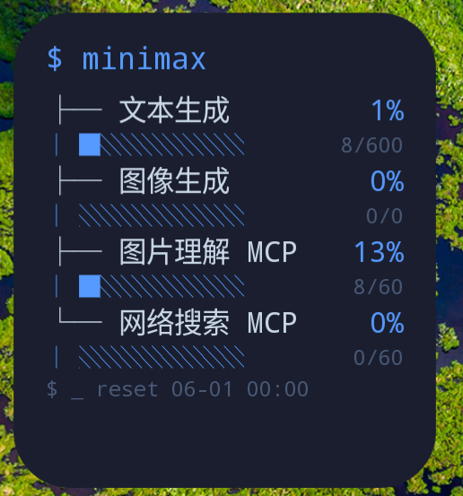
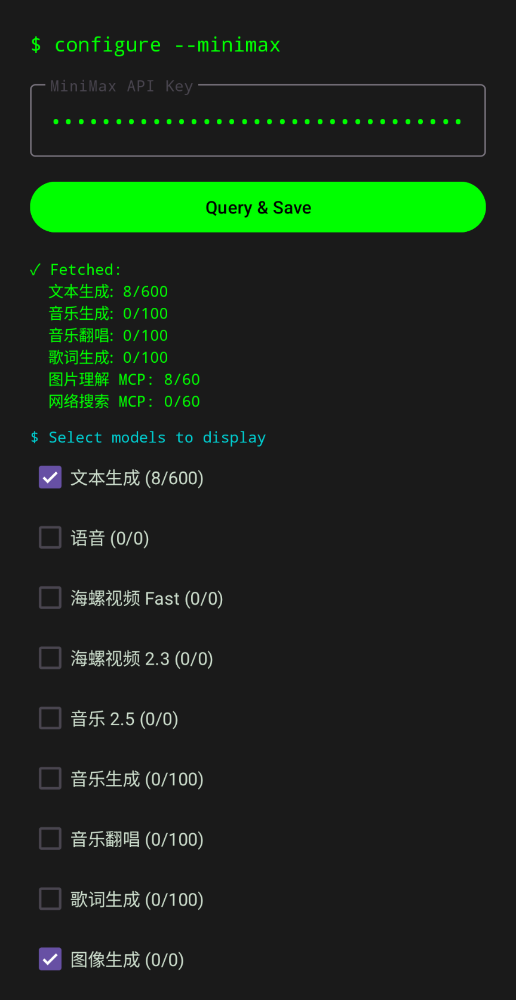

# MiniMax Balance Widget

An Android desktop widget that displays your MiniMax AI API usage balance in a terminal-inspired CLI style.

<div align="center">
  
  
</div>

## Features

- **Real-time balance tracking** — Monitor MiniMax API token usage across models directly from your home screen
- **CLI-style interface** — Terminal-inspired design with monospace font, tree branches, and command prompts (`$`)
- **Model selection** — Choose which models to display in the widget
- **Auto-refresh** — Widget data refreshes every 15 minutes in the background
- **Click to refresh** — Tap the widget to trigger an immediate refresh
- **Encrypted storage** — API key stored securely using `EncryptedSharedPreferences`

## Widget Preview

The widget displays usage quotas with:
- Model name and usage percentage
- Visual progress bar (block characters)
- Used/total count
- Reset time for the current interval

## Setup

1. Install the APK on your Android device (requires Android 8.0+)
2. Open the app to configure
3. Enter your MiniMax API key
4. Tap **Query & Save** to fetch and save your plan data
5. Select the models you want to track
6. Add the widget to your home screen

## Building

```bash
./gradlew assembleDebug
adb install -r app/build/outputs/apk/debug/app-debug.apk
```

## Tech Stack

- **Language:** Kotlin
- **Widget Framework:** Jetpack Glance (Android widget with Compose-style API)
- **Networking:** OkHttp
- **Storage:** EncryptedSharedPreferences (AES256-GCM)
- **Serialization:** Gson
- **Background Tasks:** WorkManager

## Data Source

Fetches data from MiniMax API:
- Endpoint: `https://www.minimaxi.com/v1/token_plan/remains`
- Auth: Bearer token via `Authorization` header
- Data: Current interval usage counts per model

## License

MIT
